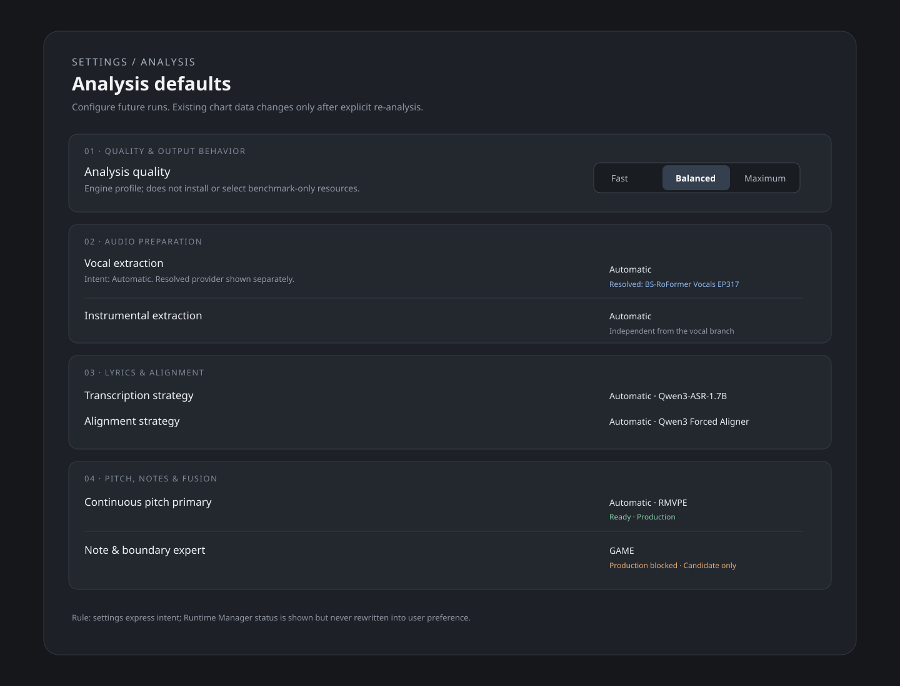
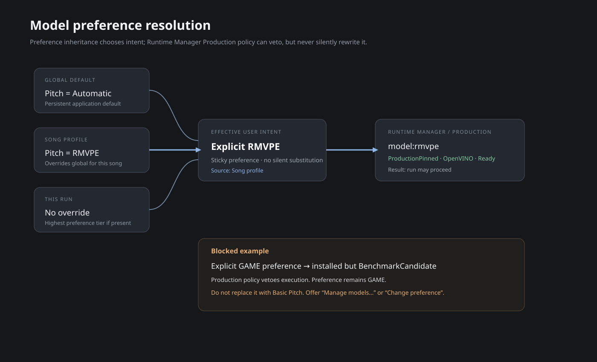
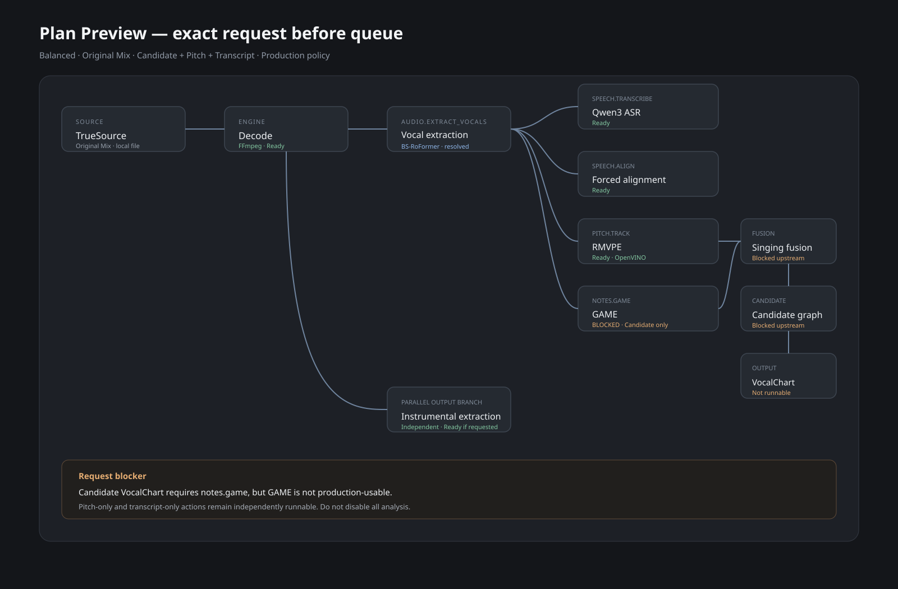
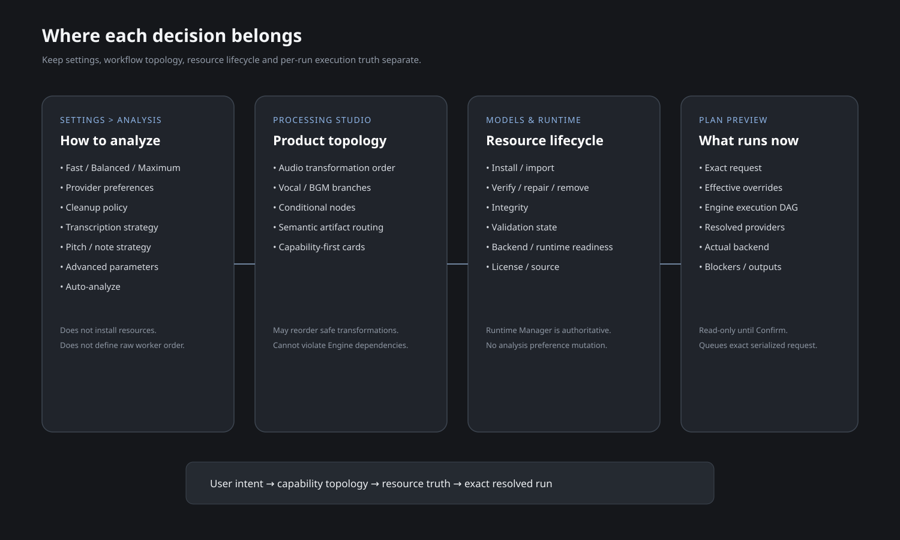
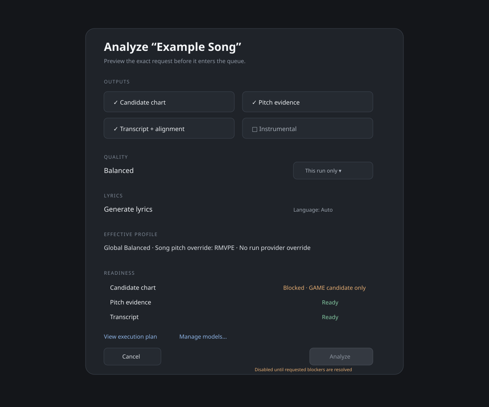
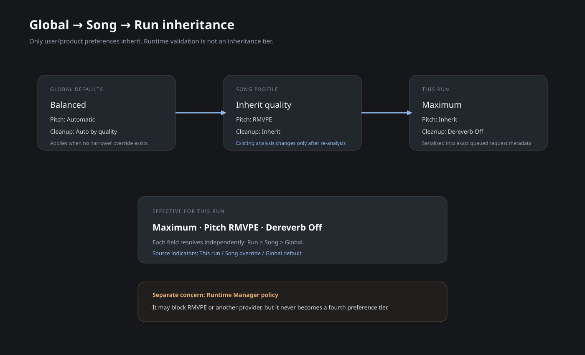

# Analysis Settings / Model Selection / Execution UX Visual Guide

These diagrams are implementation references for:

```text
docs/design/integration/UTA_STUDIO_ANALYSIS_SETTINGS_MODEL_SELECTION_EXECUTION_UX_DESIGN_v1.0.md
tasks/remaining-models/STATE.md
```

They define information hierarchy and responsibility boundaries. They are not pixel-perfect screenshots and must not override repository accessibility/layout rules.

## 01 — Analysis settings page



Use for:

- six-section Analysis Settings hierarchy;
- quality/profile placement;
- separation of defaults from lifecycle/resource management;
- aligned settings controls.

## 02 — Model/provider preference resolution



Use for:

- Automatic versus explicit-provider semantics;
- Runtime Manager policy veto;
- no silent substitution for explicit preference;
- resolved implementation as secondary metadata.

## 03 — Execution Plan Preview



Use for:

- exact request summary;
- Engine execution DAG;
- resolved resource/backend status;
- request-specific blocker presentation;
- requested output list.

## 04 — Page responsibility map



Use for keeping these surfaces distinct:

```text
Analysis Settings = defaults / strategy
Processing Studio = topology / order / conditions
Plan Preview = exact run truth
Models & runtime = resource lifecycle
```

## 05 — Run Analysis dialog



Use for:

- temporary Run Overrides;
- Global/Song effective settings before compilation;
- transition from mutable user choices to an exact `AnalyzeRequestV1`.

## 06 — Profile inheritance



Use for the precedence rule:

```text
Run Override > Song Profile > Global Default
```

Every effective value shown in an inspector/dialog must come from the same resolver used by request compilation.

## Implementation rule

Do not implement a visual element that implies a capability the current Engine contract cannot actually honor. In particular, a provider selector must not appear as an effective execution override while Engine v1 lacks a versioned provider-preference input.
