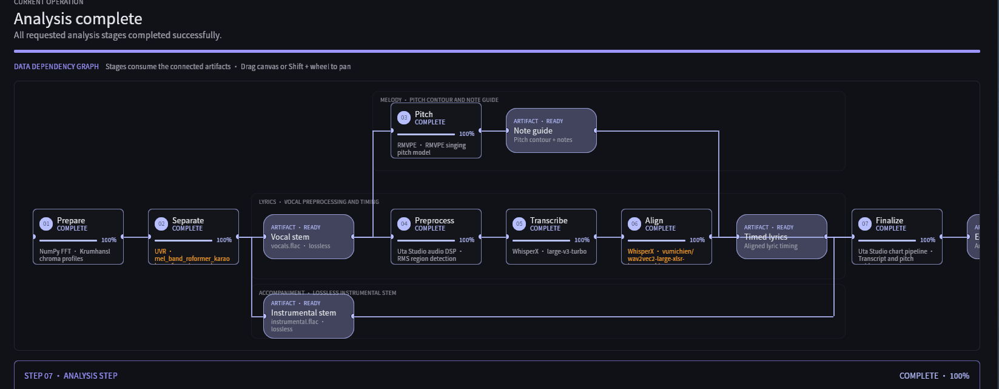
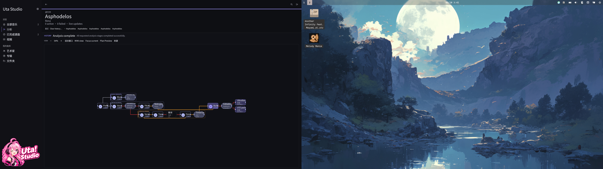

# Uta Studio UI、API 与实机验收报告

> 对应 [`plan.md`](plan.md)。最终复验：2026-08-20。

## 1. 结论

计划中的 UI 恢复、本地进程内命令覆盖、数据安全、编辑器交互、原生音频、两种真实导出、DAG 优化、DP7 实机和 Nix 打包均已完成。没有新增 HTTP 控制服务；真实媒体库只用于读取、解码和试听，修改性与破坏性路径由临时目录、临时数据库或隔离 fixture 验证。

## 2. 功能盘点与最终状态

状态分类采用计划中的五类。最终没有“后端存在但 UI 缺失”“UI 存在但 API 缺失”“损坏/不可达”或“尚未实现”的遗留项。

| 功能与用户入口 | 页面/组件 | 后端数据与本地命令边界 | 最终状态 | 正常、空/加载/禁用与错误路径 | 自动化 / DP7 |
|---|---|---|---|---|---|
| 曲库浏览、搜索、分面、网格/列表 | Library | SQLite、`load_songs`、library menu/facets | 已实现且可用 | 空库、分页、扫描失败和无封面均有状态 | contract/UI 通过；DP7 通过 |
| 独立歌曲详情、制作状态、上下文菜单 | Song detail | song/readiness/history、open/reveal/export commands | 已实现且可用 | 缺 chart、过期 candidate、分析失败和源文件不可用有提示 | 单元/UI 通过；DP7 通过 |
| 多根目录浏览与授权操作 | Folders | configured roots、`list_library_folder`、open/reveal/remove | 已实现且可用 | 越界路径拒绝；空目录和移除确认可见 | 隔离 fixture 通过；DP7 通过 |
| 分析队列、历史、取消与重试 | Analysis | queue/history/node attempts | 已实现且可用 | waiting/running/completed/failed/cancelled/blocked 均可表达 | Rust/UI 通过；DP7 通过 |
| 分析计划、单节点/下游运行、冻结/绕过/禁用 | Plan preview / node menu | planner、immutable profile snapshot、node command API | 已实现且可用 | 无效 target、不可禁用节点、缺模型均结构化报错 | planner/contract 通过；DP7 通过 |
| Artifact workbench、版本、来源、diff、影响范围 | Artifact inspector | immutable revisions、lineage、impact、active revision | 已实现且可用 | 越界路径、未知 revision、失效/删除确认均处理 | fixture 测试通过；DP7 通过 |
| 歌词搜索、导入、时间边界和语言设置 | Lyrics editor | LRCLIB、timed/plain import、transcript revisions | 已实现且可用 | 无候选、网络失败、无 note guidance 均可理解 | 文档/编辑器测试通过；DP7 通过 |
| Chart 编辑、undo/redo、问题修复、可选 inspector | Editor | typed editor actions、chart document API | 已实现且可用 | inspector 默认关闭；无 chart、保存阻塞、音频失败不阻塞编辑 | 编辑器测试通过；DP7 通过 |
| 时间/音高独立导航、拖动、缩放和自动跟随 | Editor viewport | pointer capture、viewport state、native clock | 已实现且可用 | note drag 与 pan 分离；manual scroll 暂停 follow；cancel 清理 | 交互测试通过；DP7 240 Hz 通过 |
| 原生音频播放与精确 seek | Editor / library transport | in-process native-audio；Linux GStreamer | 已实现且可用 | load/decode/seek 失败进入 UI error；播放意图保持 | 真实连续试听通过；DP7 通过 |
| UTZ 导出 | Song/detail/export all | atomic UTZ writer/validator | 已实现且可用 | 扩展名、非覆盖、失败清理、hash/manifest 校验 | 真实 smoke 通过；DP7 通过 |
| UltraStar 导出 | Song/detail/export all | atomic UltraStar writer/parser | 已实现且可用 | 扩展名、非覆盖、失败清理和 duet 校验 | 真实 smoke 通过；DP7 通过 |
| Models & runtime | Settings | runtime/model status、显式 install/remove API | 已实现且可用 | 未就绪时分析禁用并指向本页；安装必须确认 | status/fixture 测试通过；DP7 通过 |
| Analysis 参数与歌曲级覆盖 | Settings / Song detail | global/song/run snapshot | 已实现且可用 | owner-specific 控件按引擎显示；数值 clamp；重分析说明 | config/UI 测试通过；DP7 通过 |
| Storage、日志、诊断、文档与本地化 | Settings / Activity / Docs | cache stats、bounded logs、safe diagnostics | 已实现且可用 | 诊断不执行 mutation/destructive；三语 key 一致 | diagnostics/i18n/docs 通过；DP7 通过 |

设置仅在左侧导航中出现；返回动作位于左上。歌曲使用独立 route，不使用永久右侧详情栏。歌词区可隐藏以释放 timeline/spectrum 空间。

## 3. 恢复、重构和 API

### UI 与代码结构

- 将桌面状态、typed commands、UI invalidation、editor input/view、settings、library、song detail、analysis render 等按职责拆分；应用源码均不超过 2000 行。
- 桌面命令由 `AppCommand`、`LibraryCommand`、`SettingsCommand`、`AnalysisCommand`、`EditorCommand` 组成，并映射到局部 dirty region；命令失败会回写相应页面/对话框状态。
- 编辑器补全 pointer capture、全局 release/cancel、time/pitch 独立 pan/zoom、原生时钟插值、单次 Space toggle、无碰撞歌词 lane 和无音高引导标记。
- DAG 使用 rank/lane 布局、避让 routing、fit/zoom/pan、mini view、compound 展开、lineage focus、键盘焦点及明确但克制的状态样式。

### API 注册表

`api_capabilities` 共 **133** 项，命令名唯一；新增 `ui_interaction_capabilities` 与 `dispatch_ui_interaction`，把桌面交互注册表纳入本地进程内 API：

| 分类 | 数量 |
|---|---:|
| `read` | 57 |
| `mutation` | 57 |
| `destructive` | 9 |
| `external` | 9 |
| `temporary` | 1 |

桌面层另发现并注册 **320 项稳定 UI interaction command**：18 app、43 library、26 settings、82 analysis、43 editor shell、83 editor actions，以及 25 项直接 pointer/context/drag API。每个 command 都生成结构化 `UiInteractionRequest { command, access }`，鼠标、键盘和菜单共用同一 typed dispatcher。

所有显式 `Button` 必须携带 `UiAction` 或 `UiPointerApi`；运行时 `audit_ui_api_coverage` 会在每次 route rebuild 后检查实际实体。源代码 contract test 同时检查：每个 enum variant 都在可发现注册表中、每项都有 dispatch handler、每个生成的 Button 声明 API、每个右键/直接 pointer API 有渲染处理器、ID 唯一、分类合法且标记自动化。新增命令但漏掉注册、handler 或 Button 绑定会使测试失败。

覆盖 area：app、window、config、library、library audio、analysis、editor、editor audio、authoring、lyrics、models、storage、export、desktop ui、diagnostics。其余外部/破坏性业务命令通过 UI contract、隔离 fixture 或实机路径验证。

相对基线没有删除或重命名既有 command ID；本次新增桌面交互发现/dispatch API，并将普通按钮、菜单、右键入口、analysis/artifact/export 节点、歌曲/文件夹行、note/lyric/waveform/timeline、resize/drag/pan 全部纳入 typed API contract。

`run_feature_diagnostics --exports` 在真实只读库上得到 **14 passed / 0 failed / 0 skipped**；更新后的 capability 数量为 **133**。临时导出目录在返回前删除；流程没有清缓存、断开目录、安装模型、保存 chart 或排队分析。

## 4. DAG 前后对比

| 改动前 | 改动后（DP7 实机，Nix wrapped executable） |
|---|---|
|  |  |

改动后验证了空图/单节点/线性/分支/失败/大图的布局模型；所有边严格左到右，节点不重叠，长跨距 rail 不共享共线段。默认、选中、运行、成功、失败、禁用、blocked、stale 和 not-applicable 有独立语义；长标题截断在节点内，画布支持 fit、缩放、平移和 mini view。

## 5. DP7 与音频实机结果

- 会话：COSMIC，原生 Wayland（`XDG_SESSION_TYPE=wayland`，`WAYLAND_DISPLAY=wayland-1`）。
- DP7：I-O Data Device EX-LDGC251UT，物理尺寸 540 × 300 mm（约 24.3 英寸），1920 × 1080，scale 100%，实际 **239.888 Hz**。
- 窗口：DP7 borderless/fullscreen 验证；响应式逻辑另以窄窗口和 140% 字体 UI tests 验证。
- 库、歌曲详情、文件夹、队列、DAG、设置、编辑器、对话框和导出入口在 DP7 无严重遮挡；焦点、hover、disabled、selected 状态可辨。
- 高刷新率下 DAG pan/zoom、scroll 和播放头无明显卡顿或异常资源峰值。

真实 chart `Asphodelos` 的源 FLAC 通过桌面相同的 `EditorAudioPlayer` 连续播放 12 秒。native status 从 0.000 s 单调推进至 11.929 s，期间 `playing=true`，停止成功。`pw-top` 连续采样显示：

- `playback_smoke_test` stream 和 HDMI sink 均为 `R`（running）；
- stream 为 S16LE/44.1 kHz，sink 为 S32LE/48 kHz；
- sink 未显示 `MUTED`，`wpctl` 音量为 0.11；
- 每次采样 `ERR=0`，`W/Q=0.00`、`B/Q=0.00`，未观察到 quantum error 或 xrun。

测试期间没有并行 Rust/Nix 构建。waveform/timeline 的计算路径有独立测试，原生 position 是播放头权威时钟。

## 6. 真实解码与导出

安全诊断从真实已分析 chart 完成：

- 编辑器音频：ffmpeg 解码首秒成功；原生 GStreamer pipeline 对实际 instrumental FLAC 准备成功。
- UTZ：66,492,887 bytes；ZIP、manifest、声明文件、asset hash 全部验证；2 个音频资产；1 vocal track、554 notes、35,489 pitch frames 可解析。
- UltraStar：chart 8,585 bytes；parser 验证成功；2 个实际音频资产。
- 两种导出音频均完成真实 decode；lossless 输入/派生保持 FLAC，lossy 路径保持 MP3，不以改后缀伪装编码。
- 扩展名、拒绝覆盖、临时文件清理、atomic rename 和路径逃逸均有自动测试；诊断唯一临时目录已清理。

## 7. 自动化、构建和包

| 检查 | 结果 |
|---|---|
| `cargo fmt --all -- --check` | 通过 |
| `cargo check --workspace --all-targets` | 通过 |
| `cargo test --workspace --all-targets` | 通过；619 tests，0 failed |
| Python `py_compile app-core/analyzer/*.py` | 通过 |
| Native desktop/UI tests | 202 passed，0 failed |
| API registry contract | 通过（133 feature APIs + 320 UI interaction APIs；唯一、分类、handler、Button 与 pointer 覆盖合法） |
| Diagnostics + real decode + UTZ + UltraStar | 14 passed，0 failed |
| 源码 2000 行限制 | 通过；最大应用源码 1818 行 |
| `git diff --check` | 通过 |
| 项目名扫描 | 通过；应用身份、变量、协议和包名均为 Uta Studio（文档中的独立 `uta!` 游戏和 `vendor/utz` 许可证署名不是旧应用身份） |
| `nix build path:.#uta-studio --print-build-logs` | 通过 |

Nix 产物：

```text
/nix/store/h6wvr16bv6r1fpvhzc00jmvi18sgfq0r-uta-studio-0.5.0
```

从 `result/bin/uta-studio` smoke launch 成功：wrapped executable 选择 Intel Arc B580、Mesa Vulkan，创建原生 Wayland `Uta Studio` 窗口并进入 GPU preprocessing；15 秒持续运行后由 smoke timeout 正常终止。

## 8. 用户数据安全、已知问题与风险

- 未移动、删除、覆盖或改写 `/home/bintis/Documents/uta!` 下的源媒体。
- 未删除、替换或下载现有 runtime/model；启动、页面和 diagnostics 均不触发下载。
- destructive API 只验证 contract、确认 UI 和隔离 fixture；没有用真实库执行破坏性证明。
- mutation 测试使用临时 SQLite、临时 cache 或独立文件；真实库只读验证仅包括枚举、加载、解码、试听和临时目录导出。
- Linux 路径只启用 Wayland；没有 X11/XWayland fallback，也没有未认证 HTTP server。
- 完成时未发现阻塞项或功能遗留。剩余风险仅为不同 GPU/音频硬件和 Windows WASAPI 的平台差异，CI/contract 覆盖其构建与纯逻辑，当前报告的实机结论限定于上述 NixOS/COSMIC/DP7 环境。
