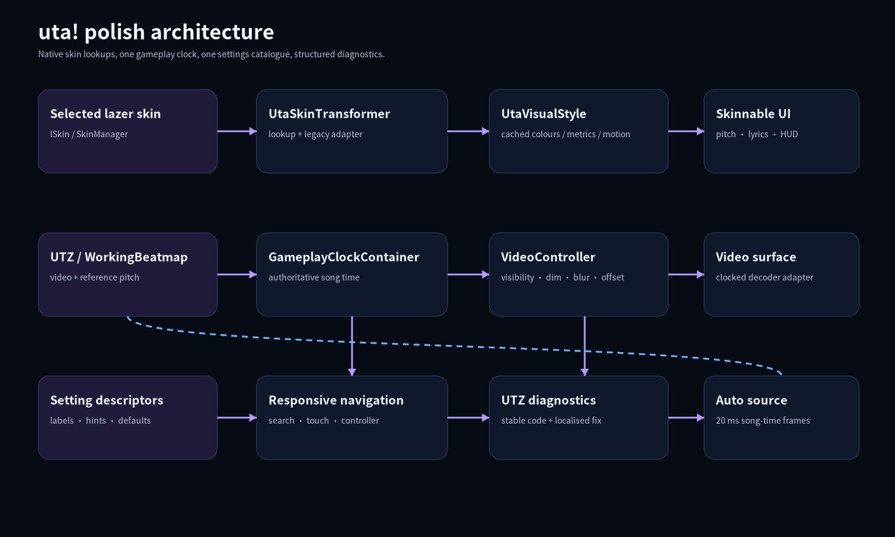
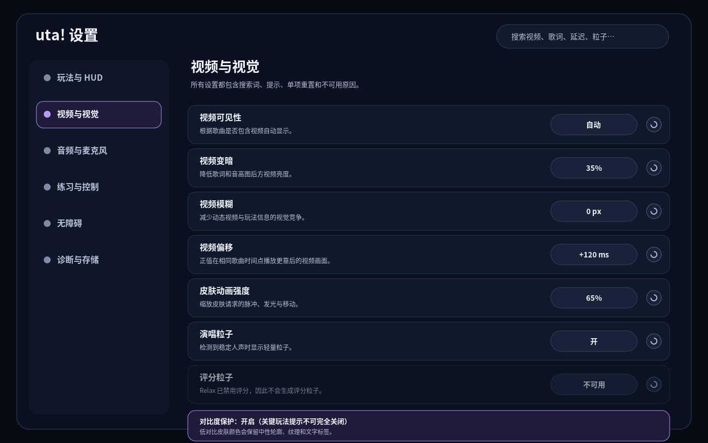
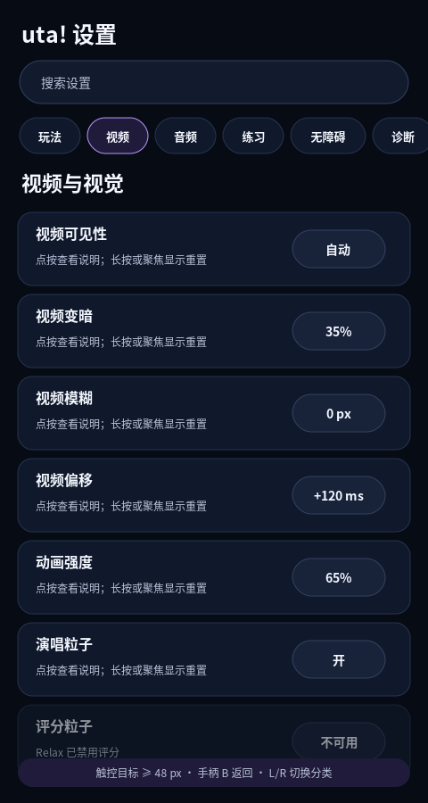
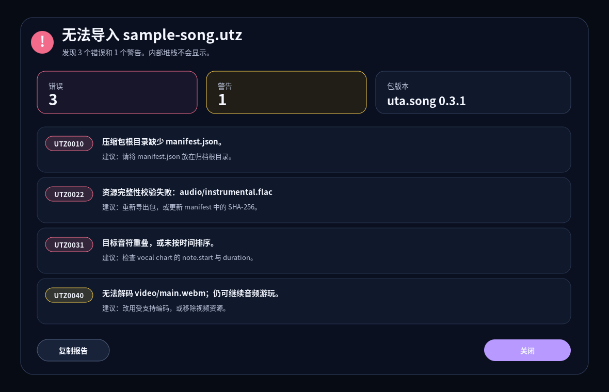

# uta! Skins、Video 与 Interface Polish 详细设计

**设计版本：** 1.0  
**目标基线：** `bintis/uta-ruleset` main，commit `ce7fd7d0d571c7d1c52f89265209d1d0761cf449`，ruleset 0.7.2  
**交付皮肤：** `uta! Prism 1.0.0`  
**核心约束：** 不引入 uta! 独立皮肤包格式；运行时全部通过 lazer 原生 `ISkin` / `SkinTransformer` / texture / config lookup 完成。



## 1. 设计结论

本方案把这组需求拆成五条彼此解耦、但共享数据契约的主线：

1. **原生皮肤桥接。** `UtaSkinTransformer` 增加 uta!-specific component lookup；连续曲线仍由 ruleset 自己绘制，皮肤提供画刷、颜色、线宽、虚线模式、间距和动画参数。这样不会为了皮肤把每段曲线变成 Drawable，也不需要新建一种皮肤包。
2. **单一时间权威。** 视频、歌词、目标音符、Auto reference Pitch 与评分都以 `GameplayClockContainer` 的 song time 为唯一权威。视频控制不能只操作 decoder；暂停、跳转、循环和速度变化必须先作用于 gameplay clock。
3. **单一设置目录。** 全局设置页与游戏内 Quick Settings 共用一套 `UtaSettingDescriptor` 元数据，标签、提示、搜索词、默认值、重置策略、可用条件和禁用原因只定义一次。
4. **结构化诊断。** `.utz` 校验不再只抛带自由文本的 `InvalidDataException`；每个问题产生稳定 code、严重性、包内相对路径、localisation key 和修复建议。UI 永远不显示 stack trace、异常类型或绝对文件路径。
5. **确定性 Auto。** Auto 优先读取 frame-level reference Pitch，按评分内核相同的 20 ms song-time bin 产生合成输入；缺失或无效时才回退到目标音符中心。该路径绕开麦克风 wall-clock 映射，保证不同帧率、速度和循环下结果一致。

## 2. 当前实现与主要差距

### 2.1 Skinning

当前 `Skinning/UtaHudController.cs` 的 transformer 只处理 lazer 的全局 HUD 容器，并把 osu! 通用 HUD 项过滤成 uta! 需要的集合。它没有 uta!-specific lookup，也没有读取 uta! 纹理、颜色、线宽、间距或 motion token。

当前玩法视觉的大多数值直接写在 UI 类中：

- `UtaPitchGuide` 固定面板高度、playhead 位置、grid line weight、target note 高度和评分颜色。
- `UtaPitchCurveGraph` 固定 reference/live 颜色和线宽。
- `UtaPitchGuideTrail` 固定 glow、轨迹宽度和相似度颜色。
- `UtaLyricsDisplay` 固定字体枚举、字号、颜色、位置和行距。
- `UtaScoringHud`、`UtaPracticeHud` 固定面板尺寸、背景、accent、圆角和文本层级。

因此第一步不是“加载一套新格式”，而是把硬编码值集中为 `UtaVisualStyle`，再由 native skin lookup 提供覆盖值。

### 2.2 Video

UTZ model 已包含 `visuals.video` 和 `video_offset_seconds`，转换器也会把 video asset 复制到 `.osz` 并写入 video event；但 event 仍从 0 开始，offset 没有进入 `UtaBeatmapMetadata` 或运行时 controller。当前 Quick Settings 只有通用 background dim/blur，没有 ruleset-aware video visibility、offset、fit 和同步控制。

osu!framework `Video` 会跟随其 drawable clock，但其 decoder 自动 hard seek 的容忍窗口较大。对很短的 A-B backward loop，单纯改 `PlaybackPosition` 不能作为严格同步保证。因此设计引入 `IUtaVideoSurface.ForceSeek()` 抽象：优先推动 framework 暴露显式 seek；ruleset-only 版本必须在 backward discontinuity 时重建 decoder surface，而不是允许画面等待自然追赶。

### 2.3 Settings 与 localisation

当前全局设置通过两个 `FillFlowContainer` Hide/Show 模拟两级页面；游戏内设置则由固定宽度右侧 overlay 和多种 `Settings*` / `Player*` 控件混合构成。很多标签和 tooltip 仍是 C# 里的英文 literal；Score HUD 与 Practice HUD 已有三语表，但其他面板没有统一资源层。

### 2.4 Import diagnostics

当前 import handler catch 所有异常后把 `ex.Message` 直接放进通知，同时完整异常进入 log。`UtzPackage` 已有良好的安全边界和很多校验点，但所有校验最后都压成同一种 `InvalidDataException` 文本，无法稳定定位、翻译、聚合或给出结构化修复建议。

### 2.5 Auto

当前 Auto 在活动音符期间把目标 MIDI 写入 live HUD bindable；它不读取 `charts.pitch_track` / `analysis.pitch_evidence`，也没有把 frame-level synthetic pitch 作为确定性评分输入。新实现必须把“演示曲线”和“回归测试输入”统一成同一个 reference source。

## 3. 原生皮肤架构

### 3.1 lookup 分层

使用三类 lazer 原生能力，职责清晰分离：

| 层 | 用途 | 例子 |
|---|---|---|
| `GetDrawableComponent()` | 可替换的完整 UI 或反馈层 | Lyrics、Score HUD、Practice HUD、Judgement Feedback Layer、Particle Layer |
| `GetTexture()` | 高频 primitive 的纹理/画刷 | target note、playhead、grid tile、curve brush、particle sprite |
| `GetConfig()` | 颜色、线宽、间距、圆角、动画强度 | `UtaSkinColour`、`UtaSkinMetric`、`UtaSkinMotion` |

连续 Pitch curve 不允许每个采样点做 drawable lookup。`UtaPitchCurveGraph` 继续用 `Path` 批量绘制，skin 只提供 curve role 的 brush texture、colour、weight 和 dash pattern。

### 3.2 lookup 类型

建议新增：

```csharp
UtaSkinComponentLookup(UtaSkinComponents component)
UtaTargetNoteLookup(UtaScoringNoteKind kind, UtaTargetVisualState state)
UtaCurveLookup(UtaCurveRole role)
UtaGridLookup(UtaGridRole role)
UtaScoringFeedbackLookup(UtaNoteGrade grade, UtaPitchFault faults)
```

配置使用三个 enum：

```csharp
UtaSkinColour
UtaSkinMetric
UtaSkinMotion
```

解析结果一次性写入 immutable `UtaVisualStyle`。当前 `ISkin.GetConfig()` 的 bindable 不应被当成实时更新源；换 skin 时重建 style 和 skinnable host，普通 gameplay update 不再访问 skin store。

### 3.3 lookup 优先级

1. 当前 selected skin 明确提供 uta! `Drawable` component。
2. 若存在 `uta-skin-marker`，启用 legacy `.osk` adapter，并按 `uta-*` texture 名称构造默认 uta! drawable。
3. 使用 ruleset 内置 Prism vector fallback。

`null` 表示“该 skin 没有提供”，继续 fallback。可选 component 若返回 `Drawable.Empty()`，表示 skin 明确关闭该装饰层。关键 gameplay cue 不允许被完全关闭。

### 3.4 关键与可选组件

**关键组件：** target notes、live Pitch curve、playhead、current lyrics、scoring fault text。即使 skin 缺失、返回空 drawable 或颜色对比不足，ruleset 仍保留最小高对比 outline、pattern 或文字标签。

**可选组件：** grid、guide trail、singing particles、scoring particles、panel decoration。可安全省略或由 skin 显式关闭。

### 3.5 纹理 fallback

目标音符示例：

```text
uta-target-note-{kind}-{state}
  -> uta-target-note-{kind}
  -> uta-target-note-normal
  -> built-in vector capsule
```

评分反馈示例：

```text
skin drawable UtaScoringFeedbackLookup
  -> uta-feedback-{grade}
  -> built-in icon + localised grade/fault text
```

字体示例：

```text
skin requested bundled alias
  -> Torus
  -> framework glyph fallback
```

不允许从 `.osk` 动态加载任意字体文件。这样可以避免缺字、平台差异和不可信字体解析问题；本交付包也不包含字体文件。

## 4. 可皮肤化组件规格

### 4.1 Pitch panel 与 grid

- panel 高度允许 `140-260 px`，默认 `180 px`。
- horizontal margin 允许 `12-64 px`，narrow window 下自动减小。
- playhead fraction 默认 `0.25`，安全范围 `0.15-0.40`。
- major grid `0.75-2.5 px`，minor grid `0.5-1.5 px`。
- grid 可省略，但 octave/tonic 辅助标记应由 accessibility layer 在需要时保留。

### 4.2 Target notes

- 形状：Capsule、Rounded Rect、Diamond Cap、Segmented、Dotted；不得只靠颜色区分 note kind。
- 高度安全范围 `6-18 px`；border `1-4 px`；最小宽度 `16 px`。
- Normal：实心 capsule。
- Golden：左端 star/diamond cap。
- Freestyle：对角纹理。
- Rap：分段块。
- Spoken：中心点列。
- grade 完成态继续用 icon、outline 和文字反馈，不能仅把 note 改成红/绿。

### 4.3 Reference 与 live Pitch curve

- reference 默认 `2.25 px` 蓝色实线。
- live 默认 `3.25 px`，比 reference 至少粗 `1 px`。
- accurate：实线 + halo。
- near：长虚线。
- off：点划线 + 高/低方向 tick。
- line weight 安全范围 reference `1.5-6 px`、live `2-8 px`。
- 未发声时不绘制连续线；可显示低密度 neutral marker，但 reduced motion 下关闭。

### 4.4 Playhead

playhead 是关键时间定位 cue：

- 主线必须与 panel 背景至少 `3:1` 非文本对比。
- 上下至少一个 diamond/notch，保证在低分辨率和视频背景下可定位。
- skin 可改变颜色、宽度和端点形状，但不能把 alpha 降到不可见。

### 4.5 Lyrics

- whole component 可通过 `UtaSkinComponentLookup(Lyrics)` 替换。
- 默认 component 暴露 current、reading、upcoming 三种 font role、colour、size、line spacing、position。
- font role 只能指向 lazer bundled alias；未知 alias 回退 Torus。
- 每个 word 仍由 ruleset timeline 驱动；skin 不能改变歌词时间。
- 当前词必须同时有 brightness/underline/weight 中至少两种编码。

### 4.6 Scoring feedback 与 HUD

- Score HUD 和 Practice HUD 允许 whole component 替换，也允许默认 component 读取 panel/accent/token。
- feedback grade：Perfect star、Great double-chevron、Good check、Bad warning、Miss cross。
- pitch faults：High arrow-up、Low arrow-down、Unstable wave、Low coverage broken-ring。
- score particle 只作为装饰；grade 文本与 fault icon 始终存在。

### 4.7 Particles 与 reduced motion

普通模式：

- singing particles 最大 18；仅在 voiced + clarity 合格时生成。
- scoring particles 最大 24；note complete 时短 burst。
- 对象池复用，禁止每帧分配。

Reduced Motion：

- 两类粒子数量强制为 0。
- 不做持续漂移、旋转、景深或大幅 scale pulse。
- panel transition 缩短为 80 ms 淡入淡出；scale delta 不超过 2%。

## 5. 色觉与对比保护

皮肤颜色先作为“请求色”进入 `UtaAccessiblePaletteResolver`，再生成实际使用色。保护规则：

1. 正常文本对 panel 背景至少 `4.5:1`；大字至少 `3:1`。
2. target note、live curve、playhead 等关键图形至少 `3:1`。
3. 若请求色不达标，先在保持 hue 的前提下调 lightness；仍不达标则回退到安全色。
4. 即使颜色达标，也始终保留 shape、dash、outline 或 icon 冗余编码。
5. 视频背景不可直接承载关键元素；Pitch panel 与 HUD 使用有最小 alpha 的中性 surface。

Prism palette 对默认 pitch panel 的主要关键颜色均超过 `6.5:1`；详细结果在 `design/contrast-report.json`。

测试必须覆盖 protanopia、deuteranopia、tritanopia snapshot，并做灰度检查。通过标准不是“颜色看起来不同”，而是关键信息在模拟图中仍能由形状、线型或标签识别。

## 6. Video 详细设计

### 6.1 Runtime metadata

扩展 `UtaBeatmapMetadata`，保持旧包兼容：

```csharp
string? VideoFile
double VideoOffsetMilliseconds
string? ReferencePitchFile
string? ReferencePitchFormat
```

转换器把 `visuals.video.path`、`video_offset_seconds` 和 reference pitch asset path 写入 metadata。正 offset 定义为：

```text
expectedVideoPosition = gameplaySongTime + packageVideoOffset + userVideoOffset
```

因此正值表示在相同 song time 播放视频更靠后的帧。

### 6.2 组件

```text
UtaVideoController
  -> IUtaVideoSurface
       PlaybackPosition
       IsPlaying
       Buffering
       ForceSeek(time)
       ReplaceSource(streamFactory)
  -> dim overlay
  -> blur container
  -> visibility / fit state
```

Controller 不拥有独立播放时间。它只把 gameplay clock 状态投影到 video surface。

### 6.3 同步状态机

- **Load：** 创建 surface，设置 gameplay clock，`ForceSeek(expected)`。
- **Normal running：** 让 drawable clock 自然推进；不在每帧写 PlaybackPosition。
- **Rate change：** gameplay clock rate 是唯一输入；video 与 lyrics/pitch 同步变化。
- **Pause：** gameplay clock 停止；surface 保持当前帧。
- **Forward seek：** `ForceSeek(expected)`。
- **Backward seek / A-B loop：** 必须显式 decoder seek。若 framework API 无法保证小于内部 lenience 的 backward seek，ruleset-only adapter 重建 surface 并从 expected 开始。
- **Source end：** freeze last frame 或隐藏，不能自动 loop，除非 package 明确声明 loop policy。
- **Buffering：** 显示非阻塞状态；音频与评分继续。超过阈值后可自动隐藏视频，不暂停 gameplay。

### 6.4 Settings

- Visibility：Auto / On / Off。
- Dim：`0-90%`。
- Blur：`0-30 px`；硬件不支持时禁用并解释原因。
- Offset：`-5000..+5000 ms`，step 10 ms，单项 reset 回 package offset。
- Fit：Crop / Contain。
- Practice controls：显示 pause、restart、seek；所有 action 委托 gameplay clock。

### 6.5 Video 验收

- 0.5×、1.0×、1.5× 连续 30 分钟无可见累计 drift。
- pause 后画面保持；恢复后 2 帧内继续。
- forward/backward seek、A-B loop 后 2 个 render frame 内显示目标时间附近画面。
- package offset 与 user offset 可独立 reset。
- 视频解码失败不影响音频玩法，并产生 `UTZ0040` warning。

## 7. Native 两级设置导航



### 7.1 信息架构

第一级为六个 category：

1. Gameplay & HUD
2. Video & visuals
3. Audio & microphone
4. Practice & controls
5. Accessibility
6. Diagnostics & storage

第二级为 category page。Desktop 宽度显示左侧 category rail；中等宽度变为顶部 tab/pill；narrow window 使用横向可滚动 category chip 和全宽 setting row。

### 7.2 统一 descriptor

每项设置必须有：

```text
id
category
labelKey
descriptionKey
searchTerms
defaultValue
value formatter
reset behaviour
availability predicate
disabledReasonKey
accessibilityNameKey
quickPanelEligibility
```

Global Settings 与 Quick Settings 仅是两个 renderer，共用同一 descriptor。这样可以消除同一设置在两个页面标签、tooltip、默认值和禁用逻辑不一致的问题。

### 7.3 Reset 与 disabled state

- 每个 row 都有单项 reset；desktop hover/focus 显示，touch 布局长按或 overflow menu 显示。
- category 提供“重置本页”，但需二次确认。
- disabled control 不只变灰：description 下方显示 `disabledReasonKey`。
- 依赖例：无 video asset 时 video settings disabled；Reduced Motion 时 particle 与 animation intensity 显示原因；Relax 时 scoring particle/HUD disabled；Auto 时 microphone-only settings说明不适用。

### 7.4 搜索

搜索索引包含 label、description、setting id、英文/中文/日文 keywords、常见简称，如 `mic`、`MV`、`BGM`、`latency`。结果保留 category breadcrumb，并支持直接 reset。

### 7.5 Narrow、touch、keyboard、controller



- `<560 px`：单列，touch target 默认不小于 48 px；Large Touch Targets 为 56 px。
- `560-839 px`：顶部 category tabs + 单列/双列混合。
- `>=840 px`：左 rail + content。
- Keyboard：Tab 顺序稳定；Enter/Space 激活；Escape 返回上一层；Ctrl+F 聚焦搜索。
- Controller：D-pad 移动，A 确认，B 返回，L/R 切 category；slider 使用左右键并支持加速。
- focus ring 至少 3 px，不能仅改变颜色；scroll 后保持 focused item 可见。

## 8. Localisation

资源目录：

```text
Resources/Localisation/en.json
Resources/Localisation/ja.json
Resources/Localisation/zh-CN.json
```

fallback：exact locale -> language family -> English -> key。所有 placeholder 在 build/test 中校验数量和名称一致。

迁移规则：

- Score HUD、Practice HUD 现有 key 保留兼容 alias。
- Settings、tooltips、Quick Settings、diagnostics、video state、Auto status、recording panels 全部迁移。
- `Description` attribute、button text、diagnostic row、notification text 不得再直接出现 user-facing literal。
- 枚举显示名必须走 localisation，不使用 `ToString()`。

本交付的 `design/localisation/` 已给出 English、Simplified Chinese、Japanese 基础覆盖。

## 9. `.utz` Import Diagnostics



### 9.1 数据模型

```csharp
UtzDiagnostic
  Code
  Severity
  MessageKey
  PackageRelativePath
  RemediationKey
  Arguments
```

Validation 层抛 `UtzValidationException` 或返回 `UtzValidationResult`；UI 不读取原始 exception message。完整异常仍可写 log，但 UI 只显示稳定 code 与 localised message。

### 9.2 安全规则

- 不显示 stack trace、exception type、absolute path、用户名、home directory。
- package path 先 normalize，只允许归档相对路径；控制字符与超长文本被裁剪。
- Copy report 包含 app/ruleset version、UTZ version、diagnostic codes、相对路径和 sanitised context。
- unexpected failure 使用 `UTZ0099` + incident ID；incident ID 与 log 对应，但 UI 不泄露内部细节。

### 9.3 UX

- Import notification 简短说明并提供“查看详情”。
- Diagnostics view 顶部显示 error/warning 数与 package version。
- 每项显示 code、localised explanation、相对路径、修复建议。
- warning 可允许“继续仅音频导入”；error 阻止导入。
- recent import diagnostics 可从 Settings > Diagnostics & storage 再次打开。

## 10. Auto：Reference Pitch 演示与回归测试

### 10.1 数据源优先级

1. UTZ 0.2/0.3 `analysis.pitch_evidence`。
2. UTZ 0.1 `charts.pitch_track`。
3. Target-note centre fallback。

frame-level 数据不应整段 base64 塞入 `.osu` metadata；metadata 只保存 asset path/format，runtime 从 beatmap storage 异步加载并构建 time-indexed source。

### 10.2 确定性采样

评分默认 bin 为 20 ms。Auto 在 song-time 上生成：

```text
for t = lastGeneratedBin + 20ms .. currentSongTime step 20ms
    sample reference source at t
    apply transpose
    submit UtaScoringFrame(t, pitch, clarity, voiced, epoch)
```

不要把 synthetic frame 伪装成麦克风 wall-clock capture，否则不同 playback rate、render frame rate 和暂停时机会改变 mapper 输出。新增 `SubmitSynthetic(UtaScoringFrame)`，只在 Auto path 使用，并同时更新 live HUD mailbox。

### 10.3 Seek、loop、pause、speed

- Pause：不生成新 bin。
- Seek/loop：重置 source cursor，使用 scoring controller 新 timeline epoch。
- Speed change：bin 仍按 song-time 20 ms，结果与速度无关。
- Transpose：对 synthetic pitch 与 target 使用一致偏移。
- Missing reference：切到 note-centre fallback，并在 HUD/diagnostics 显示非错误状态。

### 10.4 Regression tests

- 同一 reference pitch 在 0.5×、1.0×、1.5× 得到完全相同 per-note 与 total score snapshot。
- 30/60/144 FPS update cadence 得到相同 frame sequence。
- pause 期间 frame count 不增长。
- forward seek、backward seek、A-B loop 不重复计分，并正确切 epoch。
- Transpose、OCT、HT、DT、NC 组合稳定。
- invalid/missing reference 触发 fallback；fallback 结果可独立 snapshot。

## 11. 实施阶段

### Phase 1 - Skin contract 与 fallback

- 新增 lookup enums/records、asset names、`UtaVisualStyle`。
- `UtaSkinTransformer` 增加 component/config lookup。
- legacy `.osk` marker/texture adapter。
- 将 Pitch Guide、curve、lyrics、HUD 的 hard-coded visual 值迁入 style。
- partial/full/missing skin visual tests。

### Phase 2 - Accessibility 与 particles

- contrast resolver、critical outline、pattern coding。
- singing/scoring particle pool。
- Reduced Motion 与 snapshot tests。

### Phase 3 - Video

- metadata、`IUtaVideoSurface`、controller、dim/blur/fit/offset。
- seek/loop/rate/pause matrix tests。
- video warning diagnostics。

### Phase 4 - Settings 与 localisation

- descriptor catalogue。
- desktop/mid/narrow renderer。
- search、tooltips、reset、disabled reason。
- EN/JA/ZH migration；build test 禁止 user-facing literal 回归。

### Phase 5 - Import diagnostics 与 Auto

- stable diagnostic model/view。
- reference Pitch loader 与 deterministic synthetic submission。
- scoring snapshots 和 demo validation。

## 12. Definition of Done

- 选中完全不含 uta! 元素的 skin：玩法仍清晰、无异常、无缺字。
- 选中只覆盖部分元素的 skin：未覆盖元素逐项 fallback，不发生整体降级。
- Prism `.osk` 导入成功；实现 lookup bridge 后所有命名资产可被命中。
- 关键元素在默认、protanopia、deuteranopia、tritanopia、灰度快照中可识别。
- Reduced Motion 下 particle count 为 0，无持续 decorative motion。
- 所有 setting descriptor 都有 label、description、keywords、default、reset、disabled reason。
- 480 px 窄窗口可完成全部设置操作；keyboard/controller 无 focus trap。
- EN、JA、zh-CN 无缺 key、placeholder 一致、无 raw enum `ToString()`。
- invalid `.utz` UI 无 stack trace、exception type 或 absolute path。
- Auto 在不同速度、帧率、seek/loop 组合下产生相同确定性 score snapshot。

## 13. 交付文件说明

- `Uta-Prism.osk`：标准 osu! skin archive；包含 `uta-*` 1x/@2x runtime PNG。
- `Uta-Prism-Skin-Source.zip`：PNG、editable asset board、asset map、skin.ini。
- `design/uta-prism.tokens.json`：视觉 token 设计源，不是运行时皮肤格式。
- `design/contracts/uta-skin-lookups.json`：lookup、asset naming 与 fallback 契约。
- `design/contracts/settings-catalog.json`：完整 settings metadata 草案。
- `design/contracts/utz-diagnostic-codes.json`：稳定错误码与隐私规则。
- `design/localisation/*.json`：English、Japanese、Simplified Chinese 文案。
- `design/mockups/*.svg`：可编辑界面设计稿与 PNG 预览。
- `implementation-scaffold/*.cs`：实现对照类型，不是完整可编译 patch。

> 重要限制：当前 main 分支尚未请求这些 uta-specific texture/component lookups。因此 `.osk` 可以被 lazer 作为普通 skin 导入，但在 lookup bridge 合入前，uta! gameplay 不会自动使用这些自定义资产。
